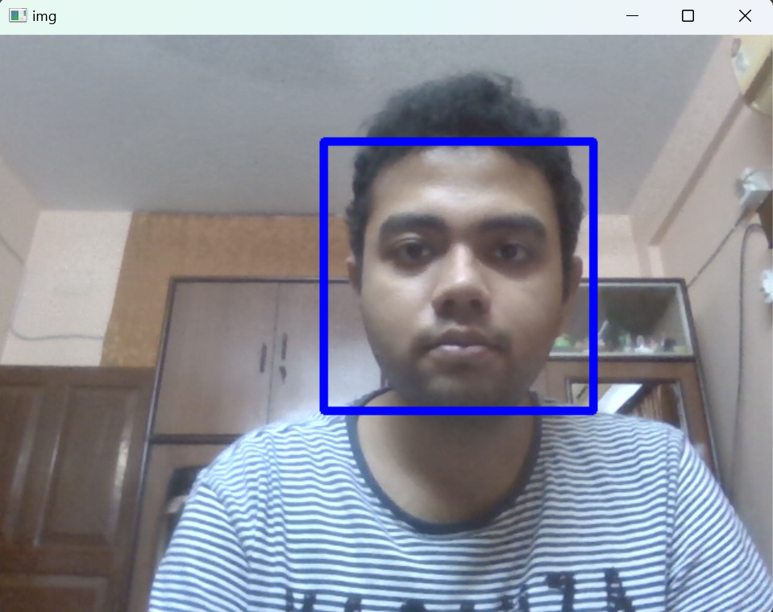

# Face Detection using OpenCV

This project demonstrates real-time face detection using a webcam feed powered by OpenCV and Haar Cascade classifiers. It captures video frames and detects human faces by drawing bounding boxes around them.

---

## 📸 Demo

 <!-- Optional: Add your own screenshot -->

---

## 🚀 Features

- Real-time webcam-based face detection
- Uses Haar Cascade Classifier (`haarcascade_frontalface_default.xml`)
- Blue rectangles drawn around detected faces
- Simple keypress (`Down Arrow`) to stop the video

---

## 🛠️ Tech Stack

- Python
- OpenCV
- Haar Cascade XML Models

---

## 📦 Installation

1. **Clone the repository**

```bash
git clone https://github.com/YOUR_USERNAME/face-detection-opencv.git
cd face-detection-opencv
```

2. **Install dependencies**
```bash
pip install -r requirements.txt
```

3. **Download Haar Cascade File**

▶️ How to Run

python face_detect.py

    Press the Down Arrow (↓) key to stop the program.

📁 Project Structure

face-detection-opencv/
│

├── haarcascade_frontalface_default.xml   # Face detection model

├── face_detector.py                        # Main Python script

├── requirements.txt                      # Required dependencies

├── README.md                             # Project README

├── LICENSE                             # LICENSE

├── output.png                             # Output Screenshot

└── .gitignore                            # Git ignore rules

📜 License

This project is licensed under the MIT License. Feel free to use and modify it.

🤝 Contribution

Pull requests are welcome! For major changes, please open an issue first to discuss what you would like to change.
